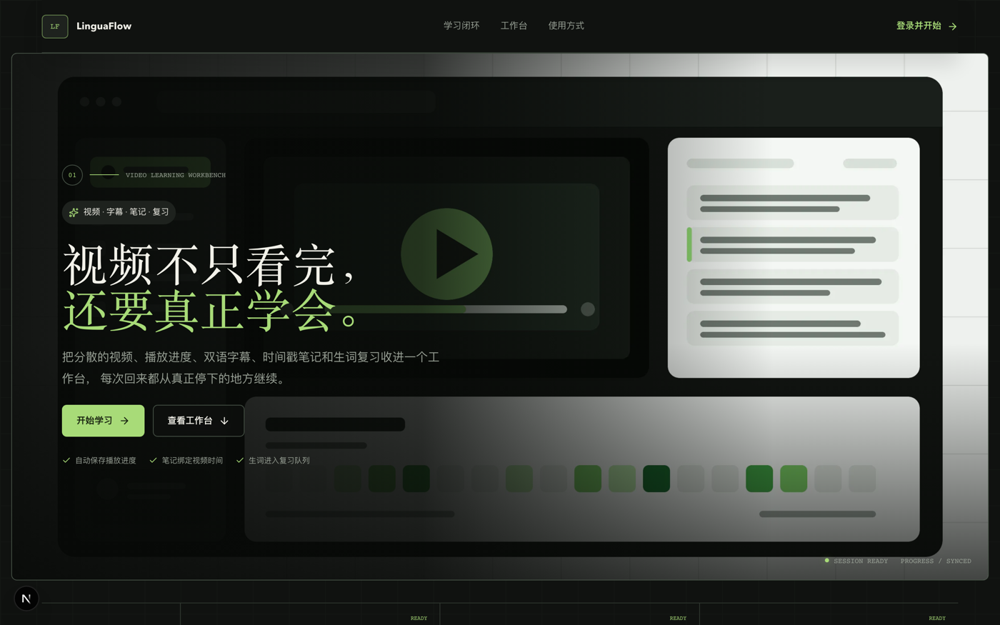
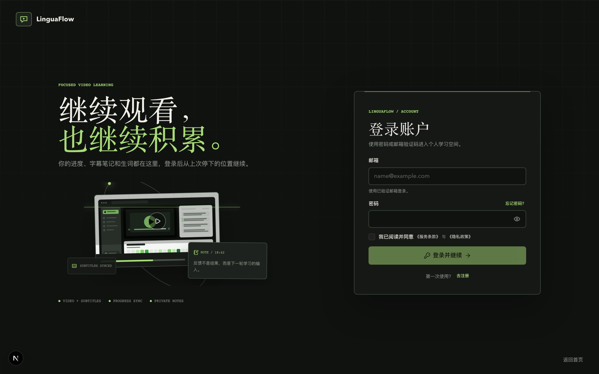
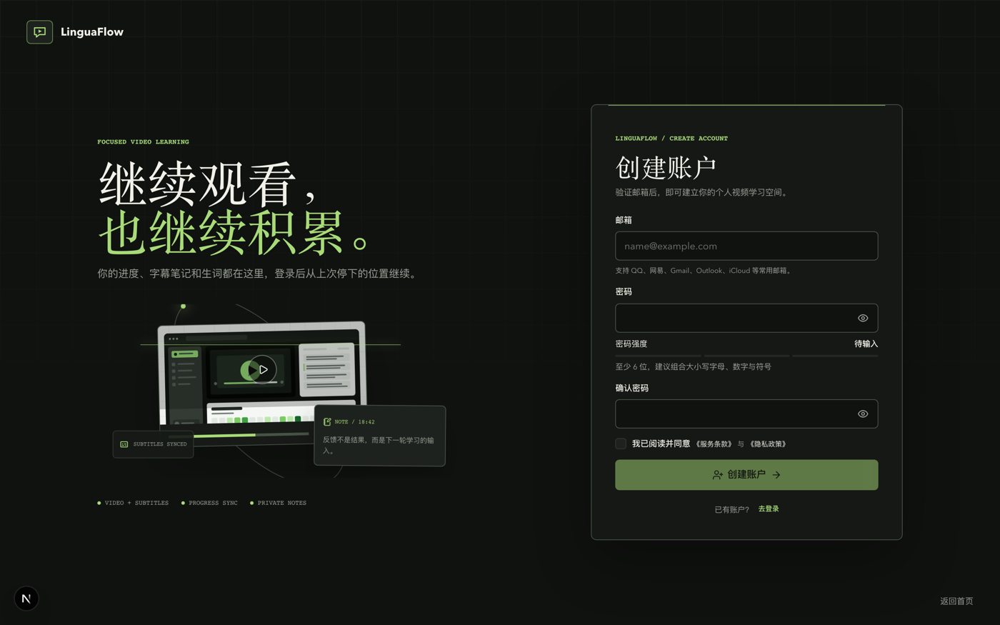
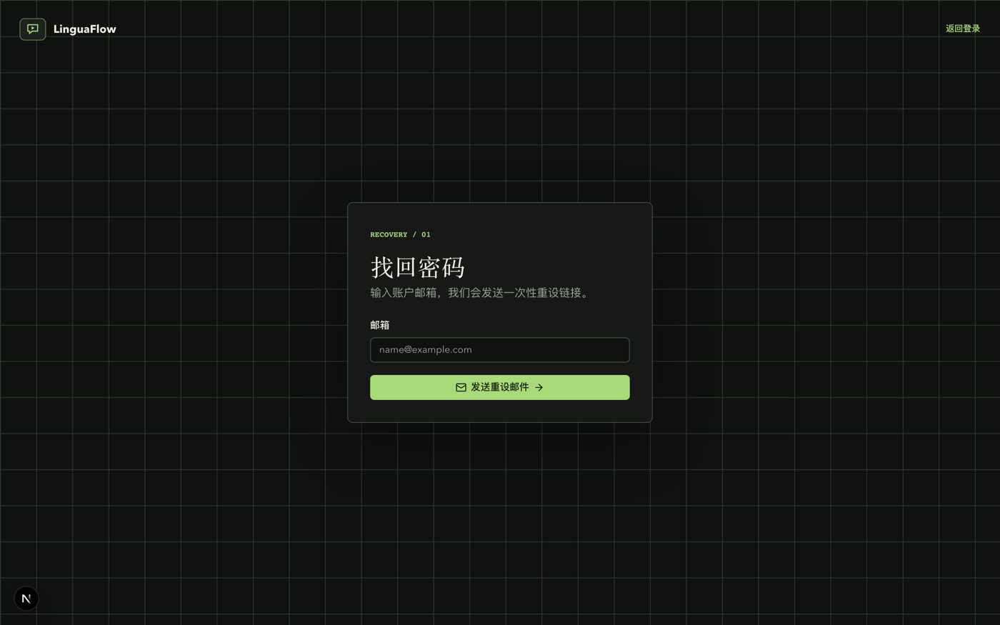
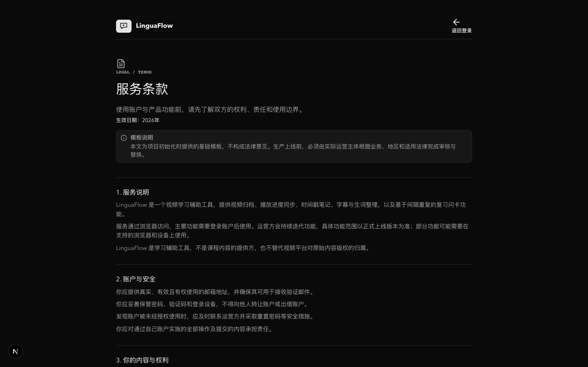
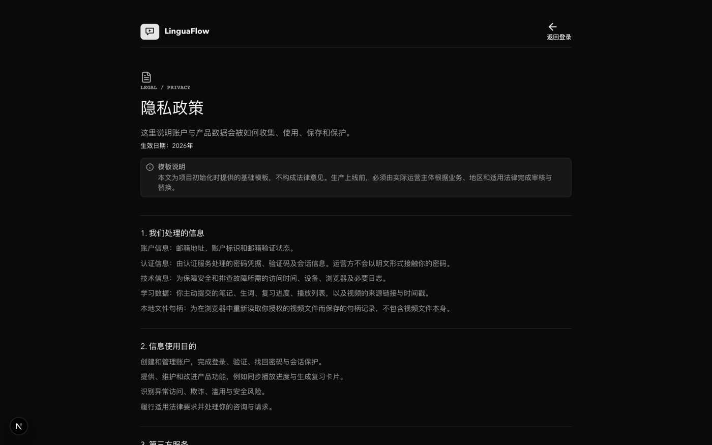

# LinguaFlow 用户使用手册

## 1. 项目介绍

LinguaFlow 是一个个人视频学习工作台，用于集中管理学习视频、播放进度、字幕、时间戳
笔记、生词、复习计划、播放列表和学习统计。账户数据存储在 Supabase；本地视频文件
保留在用户设备中，不会上传。

适用场景包括外语课程学习、公开视频精读、字幕查词、课程笔记整理和间隔复习。



本文插图仅覆盖无需登录的公开页面。播放器、资源库、生词本、复习闪卡等工作台界面
需要登录后才能访问，因此以文字步骤说明，不提供截图，以免与实际界面不符。

## 2. 功能说明

| 功能 | 说明 |
| --- | --- |
| 账户认证 | 支持注册、邮箱确认、密码登录、6 位邮箱验证码登录、找回密码和退出登录 |
| 视频导入 | 支持 YouTube、Bilibili、Vimeo、公开视频直链和本地视频文件 |
| 批量导入 | 每次最多解析 50 个唯一公开视频链接，失败项可单独重试 |
| 资源管理 | 支持搜索、分类、标签、字幕状态和学习状态筛选 |
| 视频学习 | 播放视频、保存进度、断点续看、搜索与跟随字幕 |
| 字幕管理 | 自动探测公开字幕，或导入 SRT、WebVTT、JSON、CSV、TSV、TXT |
| 字幕翻译 | 按设置的目标语言翻译当前可视字幕并保存结果 |
| 笔记 | 在当前播放位置创建、编辑、删除和跳转时间戳笔记 |
| 词典与生词 | 在播放器字幕中点词查询释义、发音、例句和词组，并收藏到生词本 |
| 间隔复习 | 按到期时间、掌握状态和目标数量生成复习队列 |
| 播放列表 | 按课程、主题或阶段组织视频；移除列表项不会删除视频 |
| 学习统计 | 展示学习时长、完成数量、笔记、连续学习和学习日历 |
| 数据导出 | 将生词本导出为 CSV 备份或 Anki TSV |
| 个性化设置 | 支持主题、字幕字号、翻译语言、复习目标、查词行为和 AI 词汇解析 |

## 3. 使用条件

- 使用部署方提供的 LinguaFlow 网址和可接收邮件的账户。
- 建议使用最新版 Chrome 或 Edge。
- 导入公开视频时，浏览器和部署服务器必须能够访问对应平台。
- 持久读取本地视频依赖浏览器 File System Access 能力；Safari、Firefox 或隐私模式
  可能只能提供有限支持。
- 可选 AI 词汇解析需要用户自行准备兼容服务的 API 地址、模型名和密钥。

## 4. 安装与访问

### 4.1 使用已部署服务

LinguaFlow 是 Web 应用，无需安装客户端：

1. 打开部署方提供的网址。
2. 选择“登录并开始”。
3. 注册并完成邮箱确认，或使用已有账户登录。



如需像应用一样启动，可使用 Chrome 或 Edge 的“安装此网站为应用”功能。该操作不是
使用 LinguaFlow 的必要条件。

### 4.2 本地自托管

开发者可在项目根目录执行：

```bash
pnpm install
cp .env.example .env.local
pnpm dev
```

在 `.env.local` 填入 Supabase Project URL 和 publishable key，然后打开
[http://localhost:5566](http://localhost:5566)。首次使用前还需初始化 Supabase 数据库
和认证配置，详见 [Vercel 部署指南](./vercel-deployment.md)。

## 5. 快速开始

1. 注册账户并通过确认邮件完成验证。
2. 登录后进入“导入视频”。
3. 粘贴公开视频链接并点击“解析”，或关联本地视频。
4. 核对标题、分类、标签和字幕后选择“加入并学习”。
5. 在播放器字幕中点击英文单词查词，并加入生词本。
6. 在关键位置添加时间戳笔记。
7. 前往“复习闪卡”完成到期复习。

## 6. 操作指南

### 6.1 注册、登录与找回密码

注册：



1. 在登录页切换到注册。
2. 输入邮箱、密码和确认密码，并同意服务条款与隐私政策。
3. 打开确认邮件并点击验证链接。
4. 返回登录页使用密码登录。

登录支持密码和邮箱验证码两种方式。邮箱验证码仅发送给已有账户。验证码为 6 位数字，
发送后存在重发冷却时间。

忘记密码时，选择“忘记密码”，提交注册邮箱并打开重设邮件。完成新密码设置后，系统会
返回原目标页面。所有站内回跳路径都会经过安全校验。



### 6.2 导入公开视频

1. 打开“导入视频”，粘贴公网 HTTP(S) 视频地址。
2. 点击“解析”，等待平台识别、元数据读取和字幕探测完成。
3. 修改标题、简介、分类和标签。标签使用逗号分隔，最多 12 个。
4. 可选择把当前标签设为以后导入的默认标签。
5. 如平台没有公开字幕，可附加不超过 2 MB 的字幕文件。
6. 点击“加入并学习”。

解析阶段只读取公开信息，不会创建视频记录。相同来源已解析过时，系统优先使用缓存；
选择“重新解析并更新”才会再次访问平台。同一账户重复导入相同来源会更新原记录。

支持的字幕文件：

- SRT 和 WebVTT。
- JSON。
- CSV、TSV 或 TXT 时间轴数据。
- 带 `Time`、`Subtitle`、`Machine Translation` 等列的表格文本。

文件必须包含可识别的时间范围和字幕文本。

### 6.3 批量导入

1. 进入“导入视频 > 批量导入”。
2. 每行粘贴一个链接；系统自动去重，最多保留 50 个。
3. 点击“全部解析”。
4. 查看就绪和失败项目，对失败项重试或移除。
5. 点击“全部加入资源库”。

批量导入只写入解析成功的项目，单个失败不会阻塞其他项目。本地地址、内网地址、非
HTTP(S) 地址以及需要登录才能访问的视频会被拒绝或解析失败。

### 6.4 关联本地视频

1. 在“导入视频”的“本地视频文件”区域选择视频。
2. 允许浏览器读取文件，核对媒体信息和内嵌字幕。
3. 必要时附加字幕，填写分类和标签后确认导入。

视频文件本身不会上传；浏览器只保存文件句柄，Supabase 保存资源键、字幕和学习数据。
更换设备、移动文件、清除站点数据或撤销文件权限后，需要重新选择原文件。建议使用
Chrome 或 Edge，并避免在隐私模式中长期学习本地视频。

### 6.5 管理视频资源库

- 点击视频封面或标题进入学习页。
- 使用搜索框匹配标题、简介或标签。
- 按来源、分类、标签、字幕状态和学习状态组合筛选。
- 在视频操作菜单中修改分类、创建分类、导入或更新字幕、加入播放列表或删除视频。
- 删除分类只会让相关视频变为“未分类”，不会删除视频。
- 删除视频会同时影响关联的进度、笔记、字幕和列表关系，确认前请核对对象。

### 6.6 播放、字幕与查词

播放器支持浏览器可直接播放的视频和平台嵌入播放器。若平台限制嵌入播放，可打开视频
来源，在返回 LinguaFlow 后继续整理字幕与笔记。

字幕面板支持：

- 点击时间戳跳转到对应位置。
- 搜索字幕文本。
- 开启或关闭字幕自动跟随。
- 定位到当前播放字幕。
- 导入、替换和预览字幕差异。
- 选择目标语言后按需翻译当前可视区域。
- 点击英文单词打开词典，并查看不同来源、发音、释义、例句和常见词组。

只有播放器字幕会高亮已收藏词汇；词典、生词本和复习页面使用普通文本。查词后可把
单词及当前语境加入生词本。公开词典或翻译服务不可用时，稍后重试即可，已保存的学习
数据不受影响。

### 6.7 时间戳笔记

1. 在播放到目标位置时切换到“笔记”标签。
2. 输入内容并点击“添加笔记”，当前时间会自动记录。
3. 点击笔记时间戳可返回对应片段。
4. 使用行内操作编辑或删除笔记。

### 6.8 生词本

生词可通过播放器字幕点词收藏，也可手动添加或批量导入。批量导入支持单词、词组和
最多 6 个英文单词组成的短语，可使用中英文逗号、换行或 CSV、TSV 文件分隔。
导入时可选择已有标签或输入新标签，并统一应用到本次新增词条。系统会为
每个词条查询公开词典并补充释义、例句和相关词组。

点击“内置词库”可选择导入 B1、B2/雅思 6 分、C1 和常用词组，也可设置应用到
本批次全部新词的词汇来源；留空时会按所选内置词库分别记录来源。系统会分批写入、
自动跳过重复词并为已有词追加对应的词库标签，但不会覆盖已有词的原始来源。内置词库
的新词会依据新词每日排期错峰进入复习队列，不会在导入当天全部到期。

在生词本中可以：

- 按单词、词组、短语、释义、标签或来源搜索。
- 为单个生词创建、选择或移除多个标签，也可在设置中重命名标签，或在批量管理中为已选生词追加标签。
- 按标签、未标记状态、掌握状态、加入时间和来源筛选；标签、掌握状态和来源支持多选。
- 按最近加入、复习到期或字母顺序排序。
- 打开详情查看音标、释义、例句、词组、构词和来源语境。
- 点击英式或美式音标朗读词条、返回来源视频、批量管理、生成可选 AI 深度解析或删除生词。

手动添加和文件导入不限制每日新增数量；内置词库使用“设置 > 学习与复习 >
新词每日排期”安排每日首次复习数量。

### 6.9 复习闪卡

1. 进入“复习闪卡”。
2. 选择随机复习，或按掌握状态、顺序和目标数量创建计划。
3. 查看题面后翻面，再按“忘记、模糊、记住、掌握”评分。
4. 系统根据评分更新下次复习时间和掌握状态。

常用快捷键：

| 按键 | 操作 |
| --- | --- |
| `Space` | 翻面或显示翻译 |
| `1`、`2`、`3`、`4` | 提交评分 |
| `P` | 朗读当前单词 |
| `Esc` | 结束本轮复习 |
| `?` | 打开快捷键说明 |

### 6.10 播放列表与学习统计

在“播放列表”中创建列表，再从资源卡片菜单加入视频。视频按加入顺序展示。移出视频或
删除播放列表只删除编排关系，不删除资源库中的视频。

“学习统计”汇总学习时长、完成视频、笔记、连续学习、最近活动、分类进度和学习日历。
播放时长、复习和笔记记录成功写入后才会出现在统计中。

### 6.11 设置、AI 与数据导出

“设置”提供：

- 浅色、深色或跟随系统主题。
- 学习日历颜色和断点续看。
- 默认字幕翻译语言与字幕字号。
- 每日复习目标、新词上限和查词自动暂停。
- 查词后自动发音。
- OpenAI、Anthropic 或自定义兼容接口的 AI 词汇解析。
- 生词 CSV、Anki TSV 导出和本地词典缓存清理。

AI 启用状态、提供商、接口类型、接口地址、模型名和 API 密钥全部保存在当前浏览器的
`localStorage`，不会写入 Supabase。不要在共享设备上保存个人密钥；使用完成后应通过
浏览器站点数据设置清理。设置页的“清除缓存”只删除 `linguaflow:cache:*` 缓存，不会
删除 AI 配置或 Supabase 学习数据。

## 7. 数据与隐私

- Supabase 同步账户、视频元数据、字幕、笔记、生词、复习记录、播放列表、统计和偏好。
- 本地视频文件不上传，文件句柄保存在当前浏览器 IndexedDB。
- AI 配置保存在当前浏览器，不随账户同步。
- 公开视频解析、词典、翻译和可选 AI 功能会访问相应第三方服务。
- 不要导入无权使用的受版权保护内容，也不要在笔记或字幕中保存敏感信息。
- 在公共设备上使用后应退出登录，并清除浏览器站点数据。

生产运营方应在上线前补充真实运营主体、数据保存期限、第三方服务清单和隐私联系方式。

完整条款见 [服务条款](../src/app/terms/page.tsx) 与
[隐私政策](../src/app/privacy/page.tsx)，线上版本分别位于 `/terms` 与 `/privacy`。





## 8. 常见问题

### 收不到确认邮件或验证码

检查垃圾邮件和邮箱地址是否正确，等待冷却时间后重试。部署维护者应检查 Supabase Auth
Logs、邮件 Provider、发送额度和模板配置。

### 邮件链接打开后提示无效或返回错误域名

链接可能已过期或已使用。重新发起操作；维护者需确认当前域名的 `/auth/callback` 和
`/auth/confirm` 已加入 Supabase Redirect URLs。

### 登录后工作区提示数据加载失败

先刷新页面并确认网络正常。若持续出现，联系维护者检查 Vercel 环境变量、Supabase
数据库结构、服务状态和 RLS 策略。

### 视频链接无法解析或播放

确认链接公开可访问且不要求登录。平台可能禁止抓取元数据、字幕或嵌入播放，此时可打开
原始来源观看，或改用本地视频并手动导入字幕。

### 没有检测到字幕

并非所有视频都公开字幕。LinguaFlow 不会生成伪造的 ASR 结果，请导入有效的 SRT、
WebVTT、JSON、CSV、TSV 或 TXT 字幕文件。

### 本地视频再次打开时要求授权

浏览器、操作系统或文件位置发生变化后，原文件句柄可能失效。选择“重新关联”并选中
原文件；学习数据和字幕仍保留在账户中。

### 字幕翻译、词典或 AI 解析失败

检查网络和第三方服务状态。AI 功能还需确认已启用配置、请求地址、接口类型、模型和
密钥正确，并先使用设置页的“验证”按钮。

### 学习进度或统计没有立即更新

暂停、结束播放或离开播放器后再刷新。平台嵌入限制、网络中断或写入失败可能导致最近
一小段进度未同步。

### 换设备后为什么无法播放本地视频或使用原 AI 配置

本地视频句柄和 AI 配置都只保存在原浏览器，不会随 Supabase 账户同步。需要在新设备
重新关联视频并重新配置 AI。

### 删除播放列表会删除视频吗

不会。删除播放列表或移出列表只影响列表关系；在资源库中删除视频才会删除相关学习数据。

## 9. 注意事项

- 上传或粘贴字幕前先核对时间轴和编码；单个字幕文件不能超过 2 MB。
- 批量导入一次最多处理 50 个唯一链接。
- 不要把 Supabase service role key、数据库密码或 AI API 密钥发送给他人。
- 清除浏览器站点数据会移除本地视频授权、缓存、主题和 AI 配置。
- 第三方视频、词典、翻译和 AI 服务的可用性、限流和内容政策不由 LinguaFlow 控制。
- 删除视频、生词和笔记前确认对象；当前界面不提供面向用户的数据回收站。
- 生产服务的隐私政策、服务条款和联系方式以部署运营方公布的版本为准。

## 10. 联系与反馈

- 产品使用、功能建议和可复现缺陷：提交到当前代码仓库的 Issues 页面，并附上操作步骤、
  预期结果、实际结果、浏览器版本和必要截图。
- 登录、账户、数据和部署故障：联系当前 LinguaFlow 实例的部署管理员。
- 安全或隐私问题：使用运营方公布的私密渠道，不要在公开 Issue 中提交密钥、访问令牌、
  邮箱验证码、个人数据或含敏感信息的日志。

当前仓库未声明公开支持邮箱。对外提供服务前，部署方必须在本节以及站内服务条款、隐私
政策中补充可验证的联系人、邮箱和响应时限。
